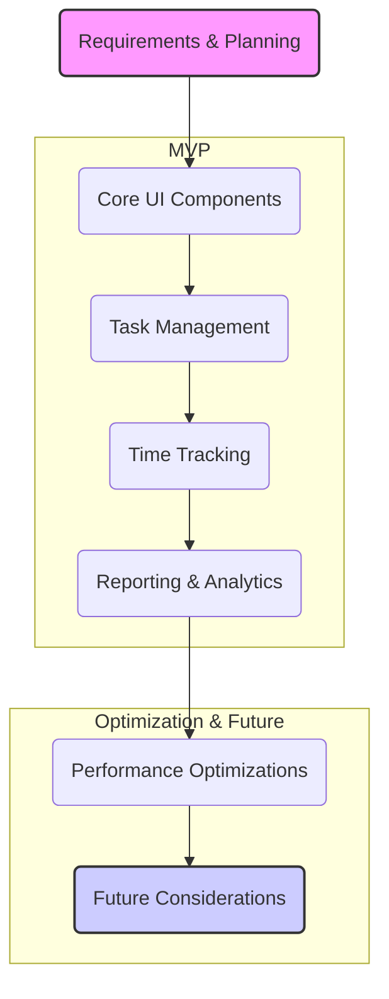

# Next Steps for TaskMan v3

This document outlines pending work and improvements for the TaskMan v3 project, organized by area of focus.

## Immediate Priority: MVP Development Plan

- [ ] **Document the complete phased approach to MVP development**
  - Define clear milestones and success criteria for each phase
  - Map features to user stories and acceptance criteria
  - Establish technical dependencies and development sequence
  - Set timelines and resource requirements
  - Align all development with the ultimate vision for TaskMan

This documentation is essential to prevent scope creep and ensure we don't get sidetracked with features that don't directly contribute to our core objectives.

## Density-Aware UI System

### Remaining Components
- [x] Apply density-aware styling to Form and FormGroup components
- [x] Convert Modal and Dialog components to use density-aware spacing
- [x] Update Menu and MenuItem components with density settings
- [x] Enhance Table component with density-specific row heights and padding

### UI Refinements
- [ ] Add smooth transitions between density levels
- [ ] Create responsive density presets based on screen size
- [ ] Add ability to override density for specific component instances
- [ ] Ensure consistent styling across all density levels
- [ ] Improve visual hierarchy in Compact mode

### Testing
- [ ] Create visual regression tests for density changes
- [ ] Test with screen readers and other accessibility tools
- [ ] Ensure proper keyboard navigation across all densities
- [ ] Create comprehensive test suite for all density-aware components

## PWA Enhancement

- [ ] Fix PWA icon loading error (`/#:1 Error while trying to use the following icon from the Manifest: https://taaskman.netlify.app/pwa-192x192.png`)
- [ ] Add proper favicon for all device sizes
- [ ] Implement proper offline mode with service worker
- [ ] Add "Add to Home Screen" prompt
- [ ] Improve application startup performance

## Bug Fixes

- [ ] Address Settings page context provider conflicts (current workaround: emergency-settings.html)
- [ ] Fix scroll position reset when navigating between views
- [ ] Address timezone inconsistencies in task dates
- [ ] Resolve rendering issues in Calendar view
- [ ] Fix network status detection in offline mode

## Performance Optimizations

- [ ] Implement lazy loading for non-critical components
- [ ] Add code splitting to reduce initial bundle size
- [ ] Optimize database queries for large datasets
- [ ] Add request batching for API calls
- [ ] Implement proper caching strategy for frequently accessed data

## User Experience Improvements

- [ ] Add interactive onboarding tour for new users
- [ ] Improve task creation flow
- [ ] Enhance keyboard shortcuts
- [ ] Add drag-and-drop support for task organization
- [ ] Implement better feedback for actions (success/error states)

## Additional Features

- [ ] Advanced sorting and filtering options
- [ ] Task templates
- [ ] Recurring tasks
- [ ] Batch operations for multiple tasks
- [ ] Enhanced reporting and analytics

## Technical Debt

- [ ] Refactor context providers to eliminate nesting issues
- [ ] Standardize error handling throughout the application
- [ ] Update dependency versions
- [ ] Improve test coverage
- [ ] Optimize build process

## MVP Requirements

**1. What is the Minimum Viable Product (MVP) for TaskMan v3?**

The MVP for TaskMan v3 focuses on delivering a user-friendly task management system with core time tracking capabilities:

- **Task Management**: Create, edit, delete, and organize tasks with categories
- **Time Tracking**: Track time spent on tasks with start/stop functionality
- **Basic Reporting**: Simple visualizations of time spent and task completion
- **Responsive Design**: Works seamlessly across devices (mobile, tablet, desktop)
- **User Authentication**: Secure login and basic user profile management
- **Offline Capability**: Essential functions work without constant internet connection
- **Modern Interface**: Clean, intuitive UI with density options for different use cases

**2. What are the critical user stories to inform MVP development?**

The most crucial user stories that should guide our MVP development:

1. **Task Entry & Organization**:
   - "As a user, I want to quickly add tasks to organize my work."
   - "As a user, I want to categorize and group related tasks."
   - "As a user, I want to set priorities and deadlines for tasks."

2. **Time Tracking**:
   - "As a user, I want to track time spent on specific tasks."
   - "As a user, I want to start and stop time tracking with minimal friction."
   - "As a user, I want to see a running timer while I'm working."

3. **Reporting & Analysis**:
   - "As a user, I want to see how much time I've spent on different tasks."
   - "As a user, I want to identify patterns in my productivity."
   - "As a user, I want to export my time data for reporting purposes."

4. **Accessibility & Customization**:
   - "As a user, I want to adjust the interface density based on my device and preferences."
   - "As a user, I want to access my tasks on any device."
   - "As a user with accessibility needs, I want to navigate TaskMan using keyboard or screen readers."

**3. What are the technical requirements for the MVP?**

Technical requirements to meet MVP functionality:

- **Frontend**: React application with responsive design
- **State Management**: Context API with proper optimization
- **Backend**: RESTful API for data persistence
- **Authentication**: JWT-based authentication system
- **Database**: Structured data storage with proper indexing for quick queries
- **Offline Support**: IndexedDB or similar for local data storage
- **Performance**: Initial load < 3 seconds, interactions respond within 300ms

**4. What might be considered outside the scope of the MVP?**

Features considered beyond MVP scope:

- Complex team collaboration features
- Advanced analytics and custom reporting
- Deep integrations with third-party services
- AI-powered recommendations
- Public API for external developers
- Native mobile applications (PWA is sufficient for MVP)

**5. How will the MVP be validated?**

The MVP will be validated through:

- User testing with a small group of representative users
- Analytics tracking of core user journeys
- Feedback collection via in-app mechanisms
- Measuring key metrics:
  - Task creation time
  - Time tracking usage frequency
  - User retention rate
  - Feature discovery rate

**6. What is the timeline for MVP development?**

The MVP development timeline is estimated at:

- **Phase 1 (2 weeks)**: Core infrastructure and authentication
- **Phase 2 (3 weeks)**: Task management functionality
- **Phase 3 (2 weeks)**: Time tracking implementation
- **Phase 4 (2 weeks)**: Reporting and analytics
- **Phase 5 (1 week)**: Final polish, performance optimization, and bug fixes

**7. What are the main risks and how will they be mitigated?**

Main risks and mitigation strategies:

1. **Performance Issues with Large Data Sets**
   - Implement pagination and virtualized lists
   - Use efficient data structures and indexing
   - Add performance monitoring

2. **Offline Synchronization Conflicts**
   - Implement robust conflict resolution strategies
   - Clear feedback on sync status to users
   - Prioritize critical data for early synchronization

3. **User Adoption Challenges**
   - Focus on intuitive UX with minimal learning curve
   - Provide interactive onboarding
   - Gather early feedback from test users

**8. Are there any specific design or UX considerations?**

Key design and UX considerations:

- **Entry Friction**: Minimize clicks/steps for core actions (e.g., add task, start timer)
- **Visual Hierarchy**: Clear indication of task status, priority, and deadlines
- **Density Options**: Support for different information density preferences
- **Accessibility**: WCAG 2.1 AA compliance for core functionality
- **Error Handling**: Clear, actionable error messages with recovery options
- **Progress Indication**: Visual feedback for loading states and background operations

**9. How will we measure success?**

Success metrics for the MVP:

- **User Engagement**: 80% of users create 5+ tasks in first week
- **Time Tracking Usage**: 50% of users track time on at least 3 tasks
- **Retention**: 70% of users return to the app at least 3 times in first week
- **Task Completion**: 60% of created tasks are marked complete
- **Performance**: 95th percentile load time under 4 seconds on standard connections
- **Errors**: Error rate below 1% for critical user journeys

**10. What comes after the MVP?**

Post-MVP priorities:

1. User feedback collection and prioritization
2. Feature refinement based on usage patterns
3. Collaboration features for team usage
4. Advanced reporting and analytics
5. Integrations with other productivity tools
6. Mobile app consideration if PWA adoption shows limitations

## Phased Development Approach

Here's a structured approach to building out TaskMan v3:

This process helps ensure that what's built aligns with the actual needs and expectations, reducing rework and ensuring focused development efforts.

---

This document is a living guide and should be updated as work progresses and priorities shift. When continuing development, refer to this document to pick up where we left off.

Last updated: April 5, 2025
